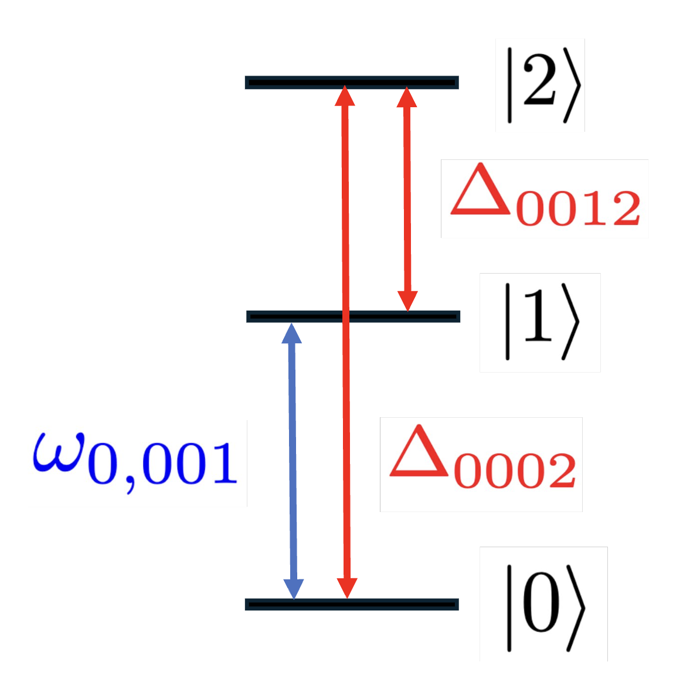
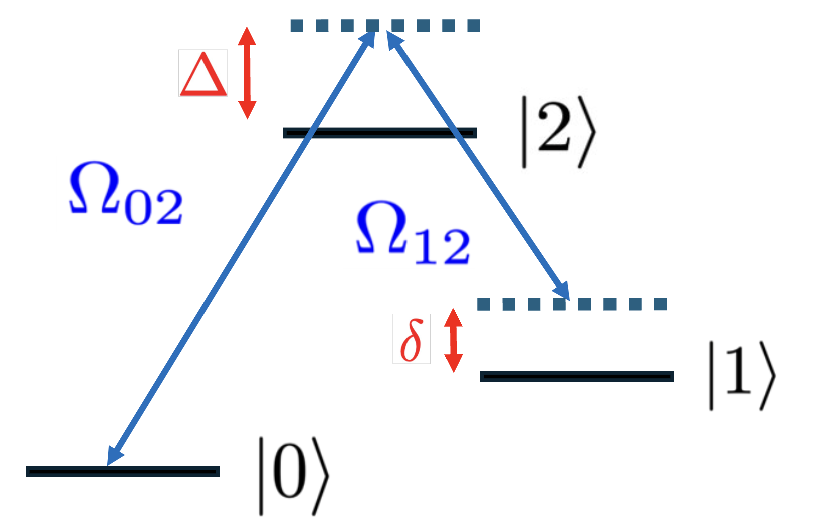

The adiabatic elimination step serves to ignore negligible physics that may result in long simulation run times or simulations being aborted entirely by QuTiP.

## Single-Photon Adiabatic Elimination

A simple example of this in action is a three level system $|0\rangle, |1\rangle, |2\rangle$ in an ion being addressed by a single laser, resonant on the $|0\rangle \leftrightarrow |1\rangle$ transition. The full Hamiltonian predicts coupling between all pairs of levels (assuming their transitions are all allowed, hence _single-photon_).

It also predicts that $\Delta*{0002}$ and $\Delta_{0012}$ will be large since the laser is far-detuned from these transitions (refer to Section 2.1 for subscript meanings). Because the probability $P$ of exciting the transition goes as $\frac{\Omega^2}{\Delta^2}$ for large $\Delta$, we expect transitions into level 2 to be extremely unlikely.

As such, a RewriteRule named [PureElimination][trical.light_matter.compiler.rule.adiabatic_elimination.PureElimination] is tasked with traversing the Hamiltonian tree, and if $\Omega_{00ij}^2 / \Delta_{00ij}^2 \ll$ than the user-defined threshold, it will remove all terms coupling levels $i$ and $j$ ($|i\rangle\langle j|$). This has the same effect as simply removing $|2\rangle$ from the Hilbert space entirely as far as levels 0 and 1 are concerned.
ｚ

## Raman Transitions (IN PROGRESS)

Raman transitions make use of a third level to drive transitions that cannot be driven directly. We'll consider a three level $\Lambda$ system, irradiated by two lasers, where we'd like to drive population between $|0\rangle$ and $|1\rangle$, and we'll use virtual absorption and emission of photons from $|0\rangle$ to do so:

These transitions can be difficult to simulate because they rely on a large $\Delta$ that is usually many orders of magnitude larger than the relevant simulation timescales, specifically the effective Rabi frequency between $|0\rangle$ and $|1\rangle$. This discrepancy in timescale makes QuTiP's integrator have to take small time steps to try and resolve quickly-evolving dynamics introduced by $\Delta$, resulting in very slow simulation times or calls to the integrator being aborted.

Thus, instead of simulating the full Hamiltonian, we must replace the parts of the tree corresponding to the $\Lambda$ system with an effective two-level Hamiltonian:

$$
    H_{\text{eff}} = \frac{\hbar\Omega_{\text{eff}}}{2}e^{-i\delta_{\text{eff}} t}|1\rangle\langle 0|D(\alpha_{\text{eff}}) + H.C.
$$

where

$$
    \Omega_{\text{eff}} = \frac{\Omega_{02}\Omega_{12}}{2\Delta}\text{,    } \vec{k}_{\text{eff}} = \vec{k}_1 - \vec{k}_2
$$

which takes on the familiar form of a two-level system being addressed by a single laser with wavevector $\vec{k}_{\text{eff}}$ and detuning $\delta_{\text{eff}}$.

$\vec{k}_{\text{eff}}$ is relevant for preserving coupling to the motional modes. In Section 2.1, we used the fact that $\vec{k}\cdot\vec{r} = \eta(a^{\dagger} + a)$ to arrive at the displacement operator $D(\alpha)$, noting that $\eta$ depends on the laser's wavevector. As such, our modified displacement operator becomes:

$$
    \begin{align}
    D(\alpha_{\text{eff}}) &= \exp \left(i(\vec{k}_1 - \vec{k}_2)\cdot\vec{r}\right)\\
    &= \exp \left(i(\eta_1(a^{\dagger} + a) - \eta_2(a^{\dagger} + a))\right)
    \end{align}
$$

After performing our usual transformation into the interaction picture,

$$
    \begin{align}
    D(\alpha_{\text{eff}}) &= \exp \left(i(\eta_1(e^{i\nu t} a^{\dagger} + e^{-i\nu t}a) - \eta_2(e^{i\nu t}a^{\dagger} + e^{-i\nu t}a))\right)\\
    &= \exp(\alpha_1 a^{\dagger} - \alpha_1^{*}a - \alpha_2 a^{\dagger} + \alpha_2^{*}a)\\
    &= \exp\left((\alpha_1-\alpha_2)a^{\dagger} - (\alpha_1 - \alpha_2)^* a\right)\\
    &= \exp\left(\alpha_{\text{eff}}a^{\dagger} - \alpha_{\text{eff}}^* a\right)
    \end{align}
$$

so $\alpha_{\text{eff}} = i(\eta_1- \eta_2)e^{i\nu t}$.

Importantly, the three levels will be light shifted by varying amounts. Specifically, the intermediate level will be shifted toward higher energies, and the other two levels will be shifted toward lower energies:

$$
    \begin{align}
    \delta_0^{\text{LS}} &= -\frac{\Omega_{02}^2}{4\Delta} \\
    \delta_1^{\text{LS}} &= -\frac{\Omega_{12}^2}{4(\Delta + \delta)} \\
    \delta_2^{\text{LS}} &= \frac{\Omega_{02}^2}{4\Delta} + \frac{\Omega_{12}^2}{4(\Delta + \delta)}
    \end{align}
$$

Right now, TrICal DOES NOT account for these Stark shifts. On one hand, one can just set $\delta_{\text{eff}} = \delta + \Sigma_i\delta_i^{\text{LS}}$, which is fine if the $\Lambda$ system is isolated (coupling only exists between these three levels when the Hamiltonian is initially constructed).
