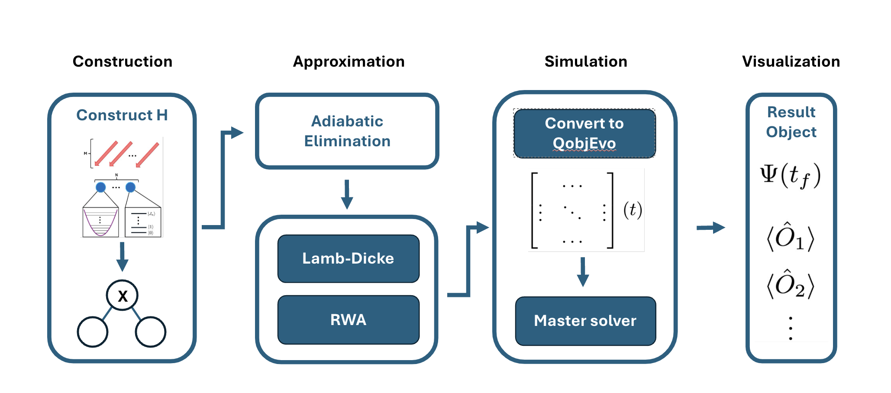

TrICal (Trapped-Ion Calculator) is a python package for simulating trapped-ion physics.

Given a description of a trapped-ion experiment with:

- $N$ ions in a chain
  - $J$ specified levels each
- $M$ lasers
- $L$ motional modes

<!-- prettier-ignore -->
/// admonition | Goal
    type: goal

1. TrICal constructs the system Hamiltonian.
2. Applies approximations to the system Hamiltonian.
3. Connects with a quantum simulation backend (e.g. QuTiP) to perform simulations.

///

TrICal is developed under [Open Quantum Design (OQD)](https://openquantumdesign.org/) as a component of the OQD open-source full stack quantum computer with trapped-ions.

